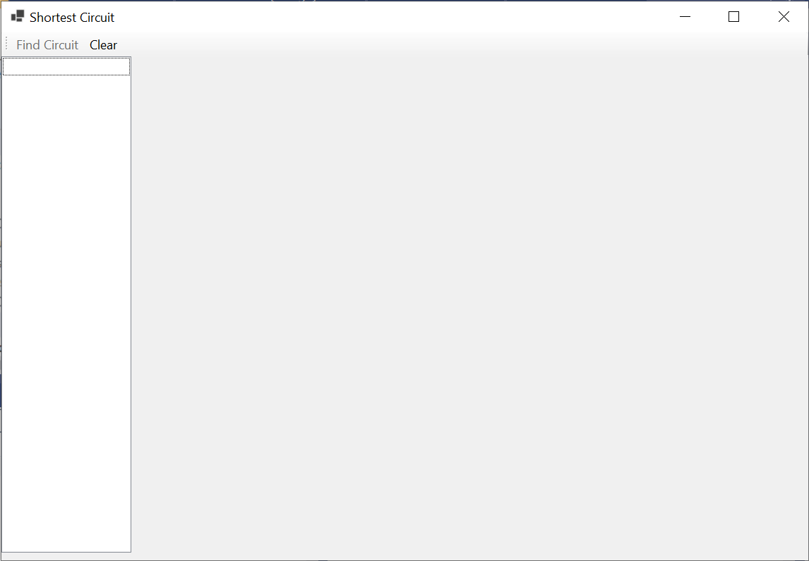
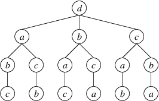

# Homework Assignment 3: Traveling Salesperson Problem

For this assignment, you will write a program to find the shortest circuit through a set of points in a plane.

## 0. Table of Contents

[TOC]

## 1. User Requirements

A company is designing an embedded system that will contain several processors on a single board. They are considering several configurations of the physical layout in order to determine the best one. One of the factors they wish to consider is the total length of network cable needed to connect the processors. Because the system will use a token ring for communication, they need to connect the processors into a circuit. Thus, your program will need to find the minimum-length circuit that contains each processor exactly once.

This problem can be viewed as a special case of the *Traveling Salesperson Problem*. In that problem, we are given a set of cities with distances between them, and we need to find a minimum-length tour that visits each city exactly once before returning to the first city in the tour. In our version, the cities are the *x*- and *y*-coordinates of the processors on a flat surface, and the distances are just the straight-line distances between the points. Thus, for two points (*x*<sub>1</sub>, *y*<sub>1</sub>) and (*x*<sub>2</sub>, *y*<sub>2</sub>), the distance between these points is:
$$
\sqrt{(x_1 - x_2)^2 + (y_1 - y_2)^2}
$$
The traveling salesperson problem is a well-known computationally hard problem - even the best solutions cannot solve large instances in a reasonable amount of time. However, the number of processors in the embedded system is not expected to be more than 13; hence, even a rather simple approach can give acceptable performance.

The program should allow the user to select a set of locations from a rectangular area, giving feedback showing which points have been selected. It should be able to find a minimum-length circuit through these points, displaying the circuit and the length to the user. It should also allow additional points to be added after a circuit is found so that a new circuit can be found for all of the points.

## 2. Starting the Assignment

Create a GitHub repository using the link provided on the Canvas assignment, and clone it to your local machine.  The repository contains a new Windows Forms App in which the class **Form1** has been renamed to **UserInterface**, along with an NUnit test project. You will need to provide the entire user interface design and all of the code.

## 3. User Interface

The [demo video](https://youtu.be/rAJ5Ruwtyyw) shows the desired look and behavior of your finished program. Here, we will first summarize the GUI design with some instructions on how you will need to set this up. We will then summarize how the finished program should respond to various user actions.

**Important:** Don't start adding code until after you have completed the GUI design described in the following section, as errors in this code will interfere with the function of the Design window.

### 3.1. GUI Design

The finished program (*not* the start code) should display a GUI resembling the following:



At the top is a **ToolStrip** containing two buttons. After you add the **ToolStrip**, it will contain a drop-down from which you can select "Button" to add a button. You will need to change each button's **DisplayStyle** property to **Text**. You can then use its **Text** property to change the text displayed on the button. The "Find Circuit" button should be disabled initially.

Below the **ToolStrip** is a **SplitContainer** - you can find this control in the "Containers" section of the Toolbox. When you add it to the form, it will fill the entire area below the **ToolStrip**. You can then adjust the position of the separator  between the two panes by dragging it. (**Note:** If the **SplitContainer** loses focus before you are finished modifying it, you probably won't be able to select it with the mouse. You should be able to select it by using the `Tab` key to cycle through all of the controls.)

The white box on the left is a **ListBox** - you can find this control in the "Common Controls" section of the Toolbox. You will need to add it to the left-hand pane of the **SplitContainer**. To make it fill this pane even when the pane's size changes, find the **ListBox**'s **Dock** property. Click on the property's value, and from the drop-down, click the large rectangle in the center.

The large gray box on the left is a control that you will need to define. In the Solution Explorer, right-click on the project **Ksu.Cis300.TravelingSalesperson** (in bold face), and select "Add->User Control (Windows Forms)...". Name this control "DrawingCanvas.cs". This should open a new Design window for this control. The only modification you will need to make in the Design window is to set its **DoubleBuffered** property to **True**. This will cause updates to be made more smoothly. All other modifications will involve adding code (see [Section 6. Coding Requirements below](#6-coding-requirements)). 

At this point, you will need to run the program in order to compile the **DrawingCanvas** class. Once you've done this, go back to your main Design window. The Toolbox should now contain "DrawingCanvas" at the top (you may need to scroll up). You can now add one to the right-hand pane of the **SplitContainer**. Dock this control as you did the **ListBox**.

Finally, in order to get a tool tip showing the location of the mouse on the **DrawingCanvas**, add a **ToolTip** to your form - you can find this control in the "Common Controls" section of the Toolbox. You don't need to change any of its properties - its behavior will be controlled by code that you add (see [Section 6. Coding Requirements](#6-coding-requirements) below).

### 3.2. Behavior of the GUI

This section details the behavior that you will need to implement, as described under [Section 6. Coding Requirements](#6-coding-requirements) below (see the [demo video](https://youtu.be/rAJ5Ruwtyyw) for examples).

When the user moves the mouse over the **DrawingCanvas**, a tool tip should show the location of the mouse within the **DrawingCanvas**. A click on the **DrawingCanvas** should cause a small "x", 3 pixels by 3 pixels, to be drawn at this location, and this location should be added to the **ListBox**. Once three points have been plotted in this way, the "Find Circuit" button should be enabled.

When the "Find Circuit" button is clicked, a shortest circuit containing the plotted points should be found and displayed as follows:

- The circuit should be drawn on the **DrawingCanvas**.
- The locations in the **ListBox** should be reordered to show the order of the points in the circuit. Each point should only be listed once.
- A **MessageBox** containing the message, "The length of the shortest circuit is: *len*", where *len* is the length of the shortest circuit, should be shown.

After a shortest circuit has been found, any subsequent clicks on the **DrawingCanvas** should plot additional points in the same way as above - the circuit should *not* be removed. Clicking the "Find Circuit" button, however, should remove any existing circuit prior to finding a new shortest circuit containing all the points. This circuit should be displayed as described above.

Clicking the "Clear" button and any time should remove everything that had been drawn on the **DrawingCanvas**, remove all locations from the **ListBox**, and disable the "Find Circuit" button.

If the form is resized, or the border between the **ListBox** and the **DrawingCanvas** is moved, both the **ListBox** and the **DrawingCanvas** should continue to fill their respective areas of the **SplitContainer**, and their contents should remain unchanged. If resizing causes some of the lines/points on the **DrawingCanvas** to be partially or completely outside of the visible area, enlarging the the form so that they are within the visible area should cause them to reappear.

## 4. Software Architecture

The following class diagram shows the architecture of the program:


The **UserInterface** class implements the main GUI. The **DrawingCanvas** class implements the control on which line segments can be drawn. The **CircuitFinder** class is a **static** class containing the methods needed to find a shortest circuit. Because the class is **static**, no instances can be constructed, and all members must be defined as **static**. 

## 5. The Shortest Circuit Algorithm

The algorithm you will use to find a shortest circuit will be based on an exhaustive search of all circuits, with two optimizations. We will first describe an exhaustive search algorithm. Then we will describe each of the optimizations.

### 5.1. Exhaustive Search

Suppose we have a set of points, *p*<sub>0</sub>, *p*<sub>1</sub>, . . ., *p*<sub>*n*-1</sub>, where *n* ≥ 3. The exhaustive search algorithm revolves around a tree defined as follows:

- The root is point *p*<sub>*n*-1</sub>. Because the circuit must contain all the points, we can arbitrarily choose this point as the starting point.
- The children of each node are all the points that do not occur in the path from the root to that node.

For example, if we call four points *a*, *b*, *c*, and *d*, in that order, we have the following tree:



Note that the order in which the children of a node are shown is unimportant. Each of the paths from the root to a leaf within this tree is a different path starting at point *d* and containing all four points exactly once. From the last point in each of these paths, we can then return to *d* to complete each of the circuits that contain each point exactly once. The exhaustive search algorithm searches this tree recursively for the shortest such circuit.

In order to search this tree, we need to maintain the length of the path to the point in the current node and two collections of points:

- The sequence of points from the root to the current node.
- The set of remaining points.

Before we describe the recursive algorithm, we need to state precisely what we want it to do at any node of the tree: We want it to return the shortest circuit beginning with the path to the current node, along with this circuit's length. Furthermore, in order to be able to make successive recursive calls, we want the algorithm to leave the two collections of points unchanged.

The base case for the algorithm is a leaf - no points remain. In this case, there is only one circuit - the path to the current point, followed by the a return to the starting point *p*<sub>*n*-1</sub>. Its length is the length of the path to the current point plus the distance from the current point to *p*<sub>*n*-1</sub>.

If points remain, we need to search each of the children. A child can be reached by moving a point *p* from the set of remaining nodes to the sequence of points, and the length of the path to this child is the length of the path to the current point plus the distance from the current point to point *p*. A recursive call then finds the shortest circuit beginning with the path to *p*. Following a recursive call, we need to move *p* from the end of the path back to the set of remaining points. We need to return the shortest of the circuits obtained by each possible recursive call.

We now observe that the algorithm outlined above doesn't need to use any representation of the tree. This tree is simply a way for us to think about how to structure the recursion. We therefore don't need to implement the tree itself.

In the next two sections, we will present optimizations to this exhaustive search algorithm.

### 5.2. Pruning Long Paths

We can optimize the above algorithm by skipping certain paths that can't possibly give us the shortest circuit. Because we are working with distances in a plane, we know that the direct distance from a given point to *p*<sub>*n*-1</sub> can't be greater than the length of a path from the same point, through some intermediate points, and finally to *p*<sub>*n*-1</sub>. Thus, at any node in the tree, we have a lower bound on the length of the circuits we are currently finding. If this lower bound is at least as large as the shortest circuit we've found so far, there is no sense extending the current path any further. In this case, we simply return the current path as the shortest circuit. We can return any length as long as it is at least as large as the shortest circuit we've found so far.

In order to implement this optimization, we need another parameter that gives us an upper bound on useful circuit lengths (essentially the shortest circuit we've found so far). Furthermore, implementing this optimization means that we sometimes will return an incomplete circuit - a circuit that doesn't contain all the points. We therefore need to modify the specification of the algorithm to state that if the length returned is greater than or equal to the bound, then all circuits have a length greater than or equal to this bound, the circuit and length returned have no other meaning.

### 5.3 Exploiting Symmetry

Any circuit that we find will have the same length as its reverse; hence, we would like to avoid checking the reverse of a circuit we have already checked. Note that because we are dealing with at least three points, *p*<sub>0</sub> and *p*<sub>1</sub> are always distinct from *p*<sub>*n*-1</sub>. Consider any circuit starting with *p*<sub>*n*-1</sub> and the reverse of this circuit. In one of these two circuits, *p*<sub>0</sub> will occur somewhere before *p*<sub>1</sub>, but in the other, *p*<sub>0</sub> will occur somewhere after *p*<sub>1</sub>. If we consider only those paths in which *p*<sub>0</sub> occurs after *p*<sub>1</sub>, any path we exclude will be the reverse of one of these paths. In this way, we can avoid checking both a path and its reverse.

To implement this optimization, we will need to represent the set of remaining points as a sequence rather than a set, so that we can keep track of which points are *p*<sub>0</sub> and *p*<sub>1</sub>. We will also need one more parameter, a **bool** indicating whether we want to find all circuits. We then modify the specification so that at a tree node where this parameter is **false** and more than one point remains to be added to the path, we will only consider those circuits in which the first remaining point (*p*<sub>0</sub>) appears later than the second remaining point (*p*<sub>1</sub>).

## 6. Coding Requirements

In what follows, we give specific coding requirements for each of the classes shown in the class diagram above. The names of most of your fields, properties, and methods don't need to match those shown in the diagram, as long as they follow the [style requirements](https://cis300.cs.ksu.edu/appendix/style/). In order for the unit test code to work, however, the **GetShortestCircuit** method of the **CircuitFinder** class must have this name. In some cases, you are required to break the code into additional **private** methods that are not described. In deciding what code to put into other methods, consider how you can use additional methods to avoid duplicating code or to shorten what would otherwise be a long method.

The code described below uses the [**Point**](https://learn.microsoft.com/en-us/dotnet/api/system.drawing.point?view=net-6.0) structure to represent a point in the plane. Note that because it is a structure, it is a value type. You will need to use the following **public** members of this structure:

- A [constructor](https://learn.microsoft.com/en-us/dotnet/api/system.drawing.point.-ctor?view=net-6.0#system-drawing-point-ctor(system-int32-system-int32)) that takes two **int** parameters giving the *x*- and *y*- coordinates of the point being constructed.
- A property [**X**](https://learn.microsoft.com/en-us/dotnet/api/system.drawing.point.x?view=net-6.0#system-drawing-point-x) that gets or sets an **int** giving the *x*-coordinate of the point.
- A property [**Y**](https://learn.microsoft.com/en-us/dotnet/api/system.drawing.point.y?view=net-6.0#system-drawing-point-y) that gets or sets an **int** giving the *y*-coordinate of the point.

### 6.1. The CircuitFinder Class

This class must be defined as **static**:

```
public static class CircuitFinder
```

You will need to define one **public** method and at least two **private** methods within this class. All of these methods will need to be **static**. You won't need any fields or properties. The **public** method and one of the **private** methods are described in what follows. You will need to decide how to break the code into at least one other **private** method.

#### 6.1.1. A private method to finish the shortest circuit beginning with a given path

This method needs the following parameters:

- A **List\<Point\>** giving the sequence of points in a path. You may assume this list is nonempty.
- A **List\<Point\>** giving the points that remain to be included in the circuit.
- A **double** giving the length of the path described by the first parameter.
- A **double** giving an upper bound on the length of a useable circuit (i.e., any circuit found that has a length greater than or equal to this bound will not be used by the calling code - see [Section 5.2. Pruning Long Paths](#52-pruning-long-paths)).
- A **bool** indicating whether all circuits should be searched. If this parameter is **false** and more than one point is given in the second parameter above, only circuits in which the second point in that list precedes the first point in that list will be searched (see [Section 5.3. Exploiting Symmetry](#53-exploiting-symmetry)).
- An **out Point[&nbsp;]** giving the sequence of points in the circuit found. If the length of this circuit is less than the value of the fourth parameter above, the length of this array should be the total number of points in the first two parameters combined; otherwise, its length is unimportant. Each point should occur at most once in this array.

It should return a **double** giving the length of the circuit described by the **out** parameter, or any value that is at least the upper bound on the length of a useable circuit if the length of the circuit described by the **out** parameter is at least this length. Note that this is the length of a circuit - hence, it should include the distance from the last point in the array back to the first point. This method should implement the recursive algorithm described in [Section 5. The Shortest Circuit Algorithm](#5-the-shortest-circuit-algorithm), including both optimizations. Use the following guidelines in implementing the algorithm:

- For efficiency reasons, don't use the **Insert** or **Remove** methods of either **List\<Point\>**. Instead:
  - You may use the **Add** method to add an element to the end of the list.
  - You may use the [**RemoveAt**](https://learn.microsoft.com/en-us/dotnet/api/system.collections.generic.list-1.removeat?view=net-6.0#system-collections-generic-list-1-removeat(system-int32)) method, but only to remove the last element in the list. This method takes an **int** parameter giving the index of the element to remove.
  - You may use indexing to obtain or replace any element.
- The base case is that either there are no points remaining to be included or the length of the given path, plus the distance back to the first point in this path, is at least the bound on the length of a useable circuit. If either of the above conditions holds, convert the path to an array using its [**ToArray**](https://learn.microsoft.com/en-us/dotnet/api/system.collections.generic.list-1.toarray?view=net-6.0#system-collections-generic-list-1-toarray) method, and return the length of the circuit described by this array. Be sure to include the distance from the last point back to the first point in this length (use the formula given in [Section 1. User Requirements](#1-user-requirements)).
- If the base case does not apply, there will always be at least one point in the list of remaining points; hence, there will be at least one recursive call. Given the above restrictions on the use of the **List\<Point\>**s, it makes sense to do one recursive call prior to entering a loop to do any remaining recursive calls. To set up this recursive call, move the last point from the list of remaining points to the end of the path. Be sure to use the length of the resulting path as the length parameter to your recursive call. The **bool** parameter can be the same value as was passed in to the current call, because if the point added to the path is *p*<sub>1</sub>, then only one point will remain, and the **bool** will be ignored. After the recursive call completes, remove the point you had added to the path.
- To do the remaining recursive calls, iterate through the remaining points, starting with index 0 if the **bool** parameter is **true**, or starting with index 1 otherwise. On each iteration, add the current point to the end of the path, and replace it in the list of remaining points with the point you removed prior to the loop. In the recursive call, the **bool** should be **true** if either the **bool** passed to the current call is **true** or the current index is 1; otherwise, it should be **false**. After the recursive call, restore the contents of the two lists to the contents they had prior to the call.
- As you are making recursive calls, it makes sense to use the parameter giving the upper bound on useable circuit lengths to keep track of the minimum circuit length, as any value larger than the value provided through this parameter will not be used.
- Before returning, be sure to restore the point that was initially removed from the list of remaining points.

#### 6.1.2. A public FindShortestCircuit method

This method needs the following parameters:

- A **List\<Point\>** containing all of points to be used in the circuit.
- An **out Point[&nbsp;]** that will contain the sequence of points in the shortest circuit.

It should return a **double** giving the length of the shortest circuit. The purpose of this method is to call the above method to obtain the value for the **out** parameter and the value to return. You will need to set up this call to operate at the root of the tree described in [Section 5. The Shortest Circuit Algorithm](#5-the-shortest-circuit-algorithm). Thus, the path should be the last point in the given list, and the list of remaining points should be the other points. You can use **double.PositiveInfinity** as the upper bound on useable values. Because the calling code will use the given list, be sure to restore it to its original contents before you return.

### 6.2. The DrawingCanvas Class

**Important:** Any errors you introduce by adding code to this class are likely to cause the Design windows to be non-functional. Be sure you have completed the GUI design before you begin working on this class. It would even be a good idea to go ahead and add empty event handlers for each of the event handlers described in [Section 6.3. The UserInterface Class](#63-the-userinterface-class); however, be sure to read the instructions for adding the event handlers described in [Section 6.3.1. An event handler to handle a MouseClick event on the DrawingCanvas](#631-an-event-handler-to-handle-a-mouseclick-event-on-the-drawingcanvas) and [Section 6.3.2. An event handler to handle a MouseMove event on the DrawingCanvas](#632-an-event-handler-to-handle-a-mousemove-event-on-the-drawingcanvas).

This class is defined to be a subclass of [**UserControl**](https://docs.microsoft.com/en-us/dotnet/api/system.windows.forms.usercontrol?view=netframework-4.7.2). This means that the **DrawingCanvas** class *inherits* all **public** and **protected** members defined in the **UserControl** class. You can use any of them as if you had defined them within this class. The ones you will need are:

- The [**ForeColor**](https://learn.microsoft.com/en-us/dotnet/api/system.windows.forms.control.forecolor?view=windowsdesktop-6.0#system-windows-forms-control-forecolor) property, which gets or sets the foreground [**Color**](https://learn.microsoft.com/en-us/dotnet/api/system.drawing.color?view=net-6.0) for this control.
- The [**Invalidate**](https://learn.microsoft.com/en-us/dotnet/api/system.windows.forms.control.invalidate?view=windowsdesktop-6.0#system-windows-forms-control-invalidate) method, which takes no parameters and returns nothing. Call this method to indicate that this control needs to be redrawn at the next opportunity.

You will need to add a **private List<(Point, Point)>** field to store the line segments to be drawn. Each tuple in this list will contain two **Point**s, which will denote the endpoints of a line segment. In addition, you will need to add two **public** methods, and you will need to override a **protected** method that is inherited from the **UserControl** class. These are described in what follows.

#### 6.2.1. An OnPaint method

This method is inherited from the **UserControl** class. It is called to draw the **DrawingCanvas** whenever it needs to be redrawn. (You will **not** need to call this code yourself - use the **Invalidate** method whenever you need to cause the control to be redrawn. **Invalidate** will ensure that this method is called appropriately.) You need to redefine this method's behavior so that it draws the line segments represented in the **List<(Point, Point)>** field. To do this, at a location in the code where a method can be defined, type "override", followed by a space. This will bring up a list of methods you can override. Select "OnPaint" from this list. A method stub for this method will be inserted.

Don't change any of the code inserted - the method header needs to be defined the way it's inserted, and the call to **base.OnPaint** (the **OnPaint** method defined in the **UserControl** class) needs to be there to take care of drawing the background and to take care of any other necessary details inherent in drawing a control. You will need to add code following this call.

The [**PaintEventArgs**](https://learn.microsoft.com/en-us/dotnet/api/system.windows.forms.painteventargs?view=windowsdesktop-6.0) parameter has a [**Graphics**](https://learn.microsoft.com/en-us/dotnet/api/system.windows.forms.painteventargs.graphics?view=windowsdesktop-6.0#system-windows-forms-painteventargs-graphics) property that gets an object of type [**Graphics**](https://learn.microsoft.com/en-us/dotnet/api/system.drawing.graphics?view=windowsdesktop-6.0), which in turn has a [**DrawLine**](https://learn.microsoft.com/en-us/dotnet/api/system.drawing.graphics.drawline?view=windowsdesktop-6.0#system-drawing-graphics-drawline(system-drawing-pen-system-drawing-point-system-drawing-point)) method that can be called to draw a line segment on the control. One of the parameters to this method is a [**Pen**](https://learn.microsoft.com/en-us/dotnet/api/system.drawing.pen?view=windowsdesktop-6.0). You will therefore need to [construct a new **Pen**](https://learn.microsoft.com/en-us/dotnet/api/system.drawing.pen.-ctor?view=windowsdesktop-6.0#system-drawing-pen-ctor(system-drawing-color)), using as the only parameter the foreground color of the control (see the inherited members listed above). Then iterate through the line segments represented in the **List<(Point, Point)>** field, drawing each line segment onto the control.

#### 6.2.2. A public method to draw a line segment

This method should take two **Point**s as its parameters. These **Point**s will give the endpoints of the line segment to be drawn. It should return nothing. This method needs to add a new **(Point, Point)** containing the given **Point**s to the **List<(Point, Point)>** field. It then needs to indicate that the control needs to be redrawn (see the list of inherited members above).

#### 6.2.3. A public method to clear the control

This method should take no parameters and return nothing. It should clear the contents of the **List<(Point, Point)>** and indicate that the control needs to be redrawn (see the list of inherited members above).

### 6.3. The UserInterface Class

This class will need the following **private** fields:

- A **List\<Point\>** containing the points entered by the user. Initialize this to a new list.
- A **Point** giving the last known location of the mouse. Initialize this to a point containing a negative value in at least one coordinate.

It will also need four event handlers and at least two other **private** methods. The four event handlers are described in what follows.

#### 6.3.1. An event handler to handle a MouseClick event on the DrawingCanvas

To create this event handler, click on the **DrawingCanvas**, and in the Properties window, click the icon that looks like a lightning bolt (this icon and the one to its left toggle views between events and properties). Find **MouseClick** in the resulting list, and double-click it. This will insert a method stub for the event handler.

The [**MouseEventArgs**](https://learn.microsoft.com/en-us/dotnet/api/system.windows.forms.mouseeventargs?view=windowsdesktop-6.0) parameter contains information about the mouse click. In particular, its [**Location**](https://learn.microsoft.com/en-us/dotnet/api/system.windows.forms.mouseeventargs.location?view=windowsdesktop-6.0#system-windows-forms-mouseeventargs-location) property gets a **Point** giving the location of the mouse click on the control. You will need to plot an "x" on this point by drawing two diagonal lines, each connecting two points diagonally adjacent to the location of the mouse click. Then add the point to the **List\<Point\>** field. If this makes the number of points greater than 2, enable the "Find Circuit" button.

You will also need to add the **Point** obtained above to the **ListBox**. To do this, you will need to use the **ListBox**'s [**Items**](https://learn.microsoft.com/en-us/dotnet/api/system.windows.forms.listbox.items?view=windowsdesktop-6.0#system-windows-forms-listbox-items) property, which gets an [**IList**](https://learn.microsoft.com/en-us/dotnet/api/system.collections.ilist?view=net-6.0) containing the elements displayed. You will need to add the **Point** to this **IList** using its [**Add**](https://learn.microsoft.com/en-us/dotnet/api/system.collections.ilist.add?view=net-6.0#system-collections-ilist-add(system-object)) method.

#### 6.3.2. An event handler to handle a MouseMove event on the DrawingCanvas

You will need to create this event handler using the same technique as for the above event handler. This event handler will be called every time the mouse is moved over the **DrawingCanvas**. It is responsible for updating the **ToolTip** to display the mouse's location.

You can get the location of the mouse in the same way as in the above method. In order to eliminate some screen flicker in the **ToolTip**, check whether this location is different from the last known mouse location. If so:

- Use the **ToolTip**'s [**SetToolTip**](https://learn.microsoft.com/en-us/dotnet/api/system.windows.forms.tooltip.settooltip?view=windowsdesktop-6.0#system-windows-forms-tooltip-settooltip(system-windows-forms-control-system-string)) method to update the **ToolTip**.  The first parameter should be your **DrawingCanvas**, and the second parameter should be the mouse's current location, converted to a **string**.
- Update the last known mouse location with its current location.

#### 6.3.3. An event handler to handle a Click event on the "Find Circuit" button

This event handler is responsible for finding a shortest circuit and displaying it on the GUI. Use the **CircuitFinder.GetShortestCircuit** method to find a shortest circuit. Then clear both the **DrawingCanvas** and the **ListBox** (use the [**Clear**](https://learn.microsoft.com/en-us/dotnet/api/system.collections.ilist.clear?view=net-6.0#system-collections-ilist-clear) method of the **ListBox**'s **Items** property), and for each point in the circuit:

- Plot the point as described in [Section 6.3.1. An event handler to handle a MouseClick event on the DrawingCanvas](#631-an-event-handler-to-handle-a-mouseclick-event-on-the-drawingcanvas).
- Add the point to the **ListBox**.

Then for each point in the circuit except the first, draw a line from the previous point in the circuit to the current one. To complete the circuit, draw a line from the last point in the circuit to the first. Finally, show a **MessageBox** to display the message described in [Section 3.2. Behavior of the GUI](#32-behavior-of-the-gui) above.

#### 6.3.4. An event handler to handle a Click event on the "Clear" button

This event handler is responsible for removing all points and lines from the **DrawingCanvas**, the **ListBox**, and the **List\<Point\>** field. It also needs to disable the "Find Circuit" button.

## 7. Testing and Performance

Unit tests have been provided to test your **CircuitFinder** class. These tests are grouped by two *traits*: "A: Short Tests" and "B: Long Tests". You should work on the short tests first (you can group the tests by traits in the Test Explorer using "Group By" icon - look for this tool tip as you hover the mouse over the icons).

All of the tests are actually done by the **TestGetShortestCircuit** method. It is passed an index into three arrays:

- `_testCasePoints`, whose elements are **Point[ ]**s giving the points used in the test.
- `_testCaseLengths`, whose elements are **double**s giving the expected shortest path length for the test.
- `_testCaseResults`, whose elements are **Point[ ]**s giving the expected sequence of points to be returned through the second parameter to **GetShortestCircuit**.

Thus, for example, the test **ShortTest(1)** uses a list containing the points in `_testCasePoints[1]` as the first parameter to **GetShortestCircuit**. It then verifies that the length returned is within 0.000001 of 1600 (the value in `_testCaseLengths[1]`) and that the **out** parameter contains the sequence of points in `_testCaseResults[1]`. 

Running the long tests will take longer than running the short tests, and may run as long as the timeout of 10 seconds if your code isn't correct. If you've grouped the tests by traits, you can run just the short tests by right-clicking on "A: Short Tests (5)" and selecting "Run".

Use the timing information from the long tests to check the optimization for pruning long paths. Both tests should finish before timing out, and **LongTest(6)** should take roughly eight times as long as **LongTest(5)**, where much more pruning can be done (you might want to try running these two tests a few times - the time required is not always the same).

Besides running the unit tests, you will also need to test the GUI to ensure that it behaves as shown in the [demo video](https://youtu.be/rAJ5Ruwtyyw). If the unit tests pass, you can be reasonably sure that the circuits it finds have the shortest length, but make sure it is displaying them correctly.

**LongTest(6)** runs in around a second on my notebook, which is almost 5 years old, but reasonably fast. The actual timing for your machine will depend on how fast it is, but even a slow machine shouldn't take more than a few seconds for this test. Likewise, the GUI should respond in a few seconds on 13 points. Larger data sets will take significantly more time.

## 8. Submitting Your Assignment

Be sure to **commit** all your changes, then **push** your commits to your GitHub repository. Then submit the *entire URL* of the commit that you want graded. 

**Note:** GitHub will **not** run the unit tests when you push your code. As for previous homework assignments, it is set up to use GitHub's autograding feature to track push times. No actual testing/grading is done, but after each push, the GitHub page for the repository will show a green check mark on the line indicating the latest commit, regardless of whether your program works or your unit tests pass. The only purpose for using the autograding feature in this way is to give us a backup indication of your push times in case you submitted your assignment incorrectly.

 